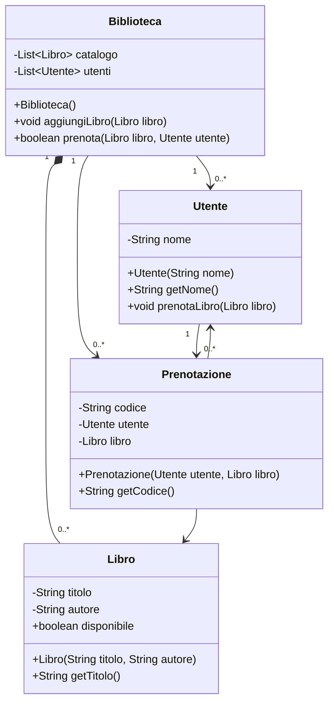
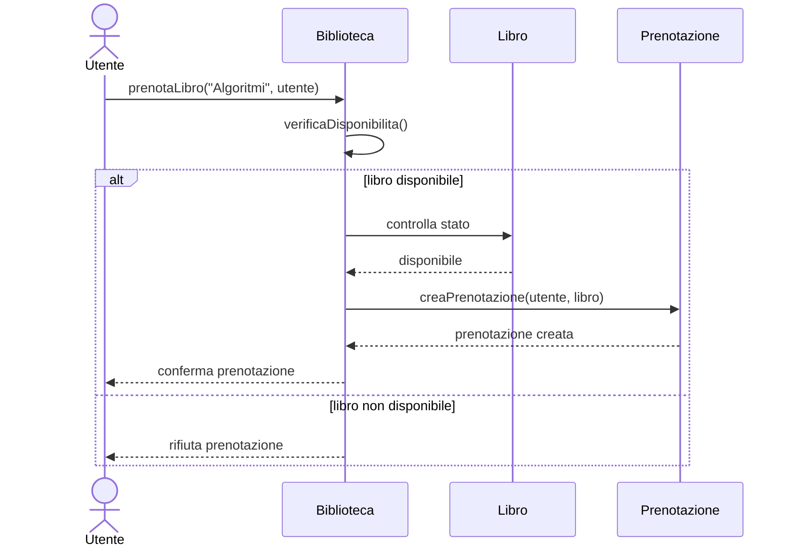

# Esercizio 12 — Architettura del progetto con due diagrammi Mermaid

Il programma Java è organizzato in classi che rappresentano gli oggetti principali del dominio: `Utente`, `Libro`, `Biblioteca` e `Prenotazione`. La struttura mostra come il sistema gestisce la disponibilità dei volumi e registra le prenotazioni.

Il diagramma `classDiagram` mostra la composizione della `Biblioteca` con i suoi libri e le relazioni con le prenotazioni. L'utente può prenotare un libro, la biblioteca verifica la disponibilità del volume e genera una prenotazione associata al libro e all'utente.

Nel diagramma `sequenceDiagram` il flusso parte dall'utente, passa alla biblioteca per la verifica della disponibilità e, in caso positivo, crea una prenotazione. Il ramo `alt ... else` rappresenta la scelta tra disponibilità e indisponibilità del libro, evidenziando il comportamento del sistema in entrambi i casi.
